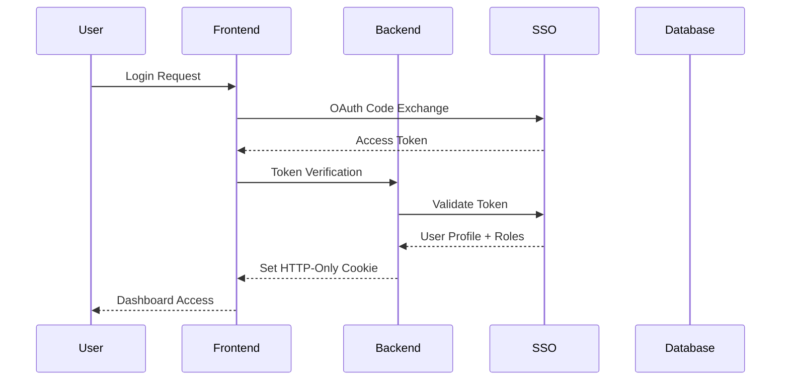
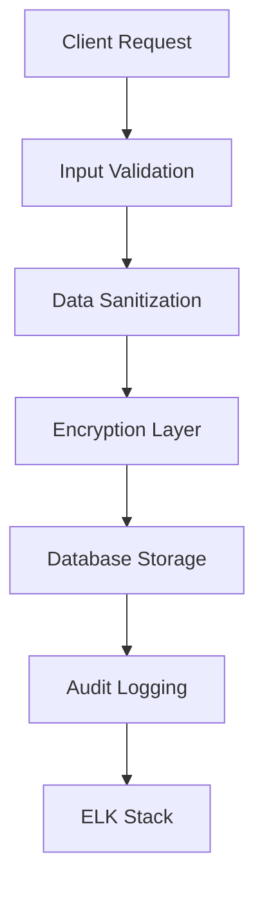
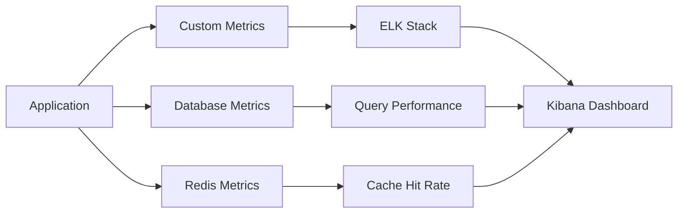

# Security and Performance Review

## Overview

This document provides a comprehensive security and performance assessment of the Score Management System, a full-stack application built with NestJS backend and Next.js frontend. The system manages score points within a financial ecosystem and integrates with external authentication services, banking APIs, and monitoring solutions.

## Repository Type Analysis

**Classification**: Full-Stack Application
- **Backend**: NestJS with TypeScript, MSSQL database, Redis caching
- **Frontend**: Next.js with React, Tailwind CSS
- **Deployment**: Docker containerized with multi-stage builds
- **Infrastructure**: ELK stack for logging, external SSO integration

## Security Assessment

### Authentication & Authorization

#### Current Implementation


#### Security Vulnerabilities Identified

| Severity | Issue | Current State | Risk Impact |
|----------|-------|---------------|-------------|
| **HIGH** | TLS Certificate Validation Disabled | `NODE_TLS_REJECT_UNAUTHORIZED = '0'` | Man-in-the-middle attacks |
| **HIGH** | Hardcoded Environment Exposure | `.env.prod` copied to Docker image | Secret leakage |
| **MEDIUM** | Missing Rate Limiting Granularity | Global throttling only | DoS vulnerability |
| **MEDIUM** | Insufficient Input Validation | Basic validation pipes | Injection attacks |
| **LOW** | Cookie Security Configuration | Missing secure flags in dev | Session hijacking |

#### Recommended Security Enhancements

**1. TLS Certificate Management**
```typescript
// Replace in auth.service.ts
// Remove: process.env['NODE_TLS_REJECT_UNAUTHORIZED'] = '0';
// Add proper certificate validation
const httpsAgent = new https.Agent({
  rejectUnauthorized: true,
  ca: fs.readFileSync(process.env.CA_CERT_PATH)
});
```

**2. Environment Variable Security**
```dockerfile
# Replace in Dockerfile
# Remove: COPY .env.prod ./
# Use Docker secrets or external vault
COPY --from=secrets /run/secrets/app-config ./config/
```

**3. Enhanced Rate Limiting**
```typescript
@Injectable()
export class EnhancedThrottleGuard implements CanActivate {
  private userRequests: Map<string, number[]> = new Map();
  private ipRequests: Map<string, number[]> = new Map();
  
  canActivate(context: ExecutionContext): boolean {
    const request = context.switchToHttp().getRequest();
    const userId = request.user?.id;
    const ip = request.ip;
    
    // Different limits for authenticated users vs anonymous
    const userLimit = userId ? 100 : 20;
    const ipLimit = 50;
    
    return this.checkRateLimit(userId, userLimit) && 
           this.checkRateLimit(ip, ipLimit);
  }
}
```

### API Security

#### Input Validation & Sanitization
```typescript
// Enhanced validation for score endpoints
export class CreateScoreDto {
  @IsString()
  @Length(10, 10)
  @Matches(/^\d{10}$/)
  nationalCode: string;

  @IsString()
  @Length(13, 13)
  @Matches(/^\d{13}$/)
  accountNumber: string;

  @IsNumber()
  @Min(1)
  @Max(1000000)
  amount: number;
}
```

#### SQL Injection Prevention
```typescript
// TypeORM parametrized queries
async findScoreByAccount(accountNumber: string): Promise<Score[]> {
  return this.scoreRepository
    .createQueryBuilder('score')
    .where('score.accountNumber = :accountNumber', { accountNumber })
    .andWhere('score.isActive = :isActive', { isActive: true })
    .getMany();
}
```

### Data Protection

#### Database Security Configuration
```typescript
export const typeormConfig = {
  type: 'mssql',
  options: {
    encrypt: true,
    trustServerCertificate: false, // Change from true
    cryptoCredentialsDetails: {
      ca: process.env.DB_CA_CERT,
      cert: process.env.DB_CLIENT_CERT,
      key: process.env.DB_CLIENT_KEY
    }
  },
  logging: process.env.NODE_ENV === 'development' ? ['error'] : false
};
```

#### Sensitive Data Handling


### Network Security

#### CORS Configuration
```typescript
const corsOptions = {
  origin: (origin, callback) => {
    const allowedOrigins = process.env.CORS_ORIGINS
      .split(',')
      .map(origin => origin.trim());
    
    if (allowedOrigins.includes(origin) || !origin) {
      callback(null, true);
    } else {
      callback(new Error('Not allowed by CORS'));
    }
  },
  credentials: true,
  methods: ['GET', 'POST', 'PUT', 'DELETE'],
  allowedHeaders: ['Content-Type', 'Authorization', 'x-api-key']
};
```

#### Security Headers Enhancement
```typescript
app.use(helmet({
  contentSecurityPolicy: {
    directives: {
      defaultSrc: ["'self'"],
      scriptSrc: ["'self'", "'unsafe-inline'"],
      styleSrc: ["'self'", "'unsafe-inline'"],
      imgSrc: ["'self'", "data:", "https:"],
    },
  },
  hsts: {
    maxAge: 31536000,
    includeSubDomains: true,
    preload: true
  }
}));
```

## Performance Optimization

### Backend Performance

#### Database Query Optimization
```typescript
// Index recommendations for score.entity.ts
@Entity('scores')
@Index(['nationalCode', 'isActive'])
@Index(['accountNumber', 'createdAt'])
@Index(['branchCode', 'status'])
export class Score extends BaseEntity {
  // Implement connection pooling
  @CreateDateColumn({ type: 'datetime2', precision: 3 })
  createdAt: Date;
  
  @UpdateDateColumn({ type: 'datetime2', precision: 3 })
  updatedAt: Date;
}
```

#### Caching Strategy Implementation
```typescript
@Injectable()
export class ScoreService {
  constructor(
    @Inject(CACHE_MANAGER) private cacheManager: Cache,
    private scoreRepository: Repository<Score>
  ) {}

  async getScoresByAccount(accountNumber: string): Promise<Score[]> {
    const cacheKey = `scores:${accountNumber}`;
    let scores = await this.cacheManager.get<Score[]>(cacheKey);
    
    if (!scores) {
      scores = await this.scoreRepository.find({
        where: { accountNumber, isActive: true },
        order: { createdAt: 'DESC' },
        take: 50
      });
      
      await this.cacheManager.set(cacheKey, scores, 300); // 5 minutes
    }
    
    return scores;
  }
}
```

#### Redis Configuration Optimization
```typescript
// Enhanced Redis configuration
export const redisConfig = {
  host: process.env.REDIS_HOST,
  port: parseInt(process.env.REDIS_PORT),
  password: process.env.REDIS_PASSWORD,
  db: 0,
  retryAttempts: 3,
  retryDelayOnFailover: 100,
  enableReadyCheck: true,
  maxRetriesPerRequest: 3,
  lazyConnect: true,
  keepAlive: 30000,
  family: 4,
  commandTimeout: 5000
};
```

### Frontend Performance

#### Next.js Optimization
```typescript
// next.config.ts enhancements
const nextConfig = {
  compress: true,
  poweredByHeader: false,
  generateEtags: true,
  
  images: {
    formats: ['image/webp', 'image/avif'],
    deviceSizes: [640, 750, 828, 1080, 1200, 1920],
    minimumCacheTTL: 60
  },
  
  experimental: {
    optimizeCss: true,
    scrollRestoration: true,
    
    // Bundle analyzer for performance monitoring
    bundlePagesRouterDependencies: true
  },
  
  webpack: (config, { dev, isServer }) => {
    if (!dev && !isServer) {
      config.optimization.splitChunks.chunks = 'all';
    }
    return config;
  }
};
```

#### Component Performance
```typescript
// Implement React.memo for expensive components
const ScoreTable = React.memo(({ scores }: { scores: Score[] }) => {
  const memoizedScores = useMemo(
    () => scores.slice(0, 50), // Limit rendering
    [scores]
  );
  
  return (
    <div className="overflow-y-auto max-h-96">
      {memoizedScores.map(score => (
        <ScoreRow key={score.id} score={score} />
      ))}
    </div>
  );
});
```

### Infrastructure Performance

#### Docker Optimization
```dockerfile
# Multi-stage build optimization for backend
FROM node:20-alpine AS base
RUN apk add --no-cache libc6-compat
WORKDIR /app

FROM base AS deps
COPY package*.json ./
RUN npm ci --only=production && npm cache clean --force

FROM base AS builder
COPY package*.json ./
RUN npm ci
COPY . .
RUN npm run build && npm prune --production

FROM base AS runner
RUN addgroup --system --gid 1001 nodejs && \
    adduser --system --uid 1001 nestjs

COPY --from=deps --chown=nestjs:nodejs /app/node_modules ./node_modules
COPY --from=builder --chown=nestjs:nodejs /app/dist ./dist

USER nestjs
EXPOSE 5004
CMD ["node", "dist/main"]
```

#### Database Connection Pooling
```typescript
export const dataSourceOptions = {
  type: 'mssql',
  pool: {
    max: 20,
    min: 5,
    acquire: 30000,
    idle: 10000
  },
  extra: {
    connectionLimit: 10,
    acquireTimeout: 60000,
    timeout: 60000,
    pool: {
      max: 20,
      min: 5,
      idleTimeoutMillis: 30000,
      createTimeoutMillis: 30000,
      acquireTimeoutMillis: 30000
    }
  }
};
```

## Monitoring & Observability

### Performance Metrics


### Error Tracking Enhancement
```typescript
@Injectable()
export class EnhancedLoggerService {
  private logger = new Logger(EnhancedLoggerService.name);
  
  logPerformance(operation: string, duration: number, metadata?: any) {
    this.eventEmitter.emit('logEvent', new LogEvent({
      logTypes: logTypes.PERFORMANCE,
      fileName: metadata?.fileName || 'unknown',
      method: operation,
      message: `Operation completed in ${duration}ms`,
      requestBody: JSON.stringify(metadata),
      duration
    }));
  }
  
  logSecurityEvent(event: string, userId?: string, ip?: string) {
    this.eventEmitter.emit('logEvent', new LogEvent({
      logTypes: logTypes.SECURITY,
      fileName: 'security',
      method: event,
      message: `Security event: ${event}`,
      requestBody: JSON.stringify({ userId, ip }),
      timestamp: new Date()
    }));
  }
}
```

## Testing Strategy

### Security Testing
```typescript
describe('Security Tests', () => {
  it('should prevent SQL injection', async () => {
    const maliciousInput = "'; DROP TABLE scores; --";
    const response = await request(app)
      .post('/score/search')
      .send({ nationalCode: maliciousInput })
      .expect(400);
  });
  
  it('should require authentication', async () => {
    await request(app)
      .get('/score')
      .expect(401);
  });
  
  it('should rate limit requests', async () => {
    const requests = Array(25).fill(null).map(() => 
      request(app).get('/score')
    );
    
    const responses = await Promise.all(requests);
    expect(responses.some(r => r.status === 429)).toBe(true);
  });
});
```

### Performance Testing
```typescript
describe('Performance Tests', () => {
  it('should respond within acceptable time limits', async () => {
    const start = Date.now();
    await request(app)
      .post('/score/search')
      .send({ nationalCode: '1234567890' });
    const duration = Date.now() - start;
    
    expect(duration).toBeLessThan(2000); // 2 seconds max
  });
  
  it('should handle concurrent requests', async () => {
    const concurrentRequests = 50;
    const requests = Array(concurrentRequests).fill(null).map(() =>
      request(app).get('/score')
    );
    
    const responses = await Promise.all(requests);
    const successfulResponses = responses.filter(r => r.status === 200);
    expect(successfulResponses.length).toBeGreaterThan(concurrentRequests * 0.9);
  });
});
```

## Implementation Roadmap

### Phase 1: Critical Security Fixes (Week 1-2)
- [ ] Remove TLS certificate validation bypass
- [ ] Implement proper environment variable management
- [ ] Add input validation and sanitization
- [ ] Configure secure cookie settings

### Phase 2: Performance Optimization (Week 3-4)
- [ ] Implement database indexing strategy
- [ ] Add Redis caching layer
- [ ] Optimize frontend bundle size
- [ ] Configure connection pooling

### Phase 3: Enhanced Monitoring (Week 5-6)
- [ ] Add performance metrics collection
- [ ] Implement security event logging
- [ ] Create Kibana dashboards
- [ ] Set up alerting system

### Phase 4: Testing & Validation (Week 7-8)
- [ ] Implement security test suite
- [ ] Add performance testing
- [ ] Conduct penetration testing
- [ ] Load testing with realistic scenarios